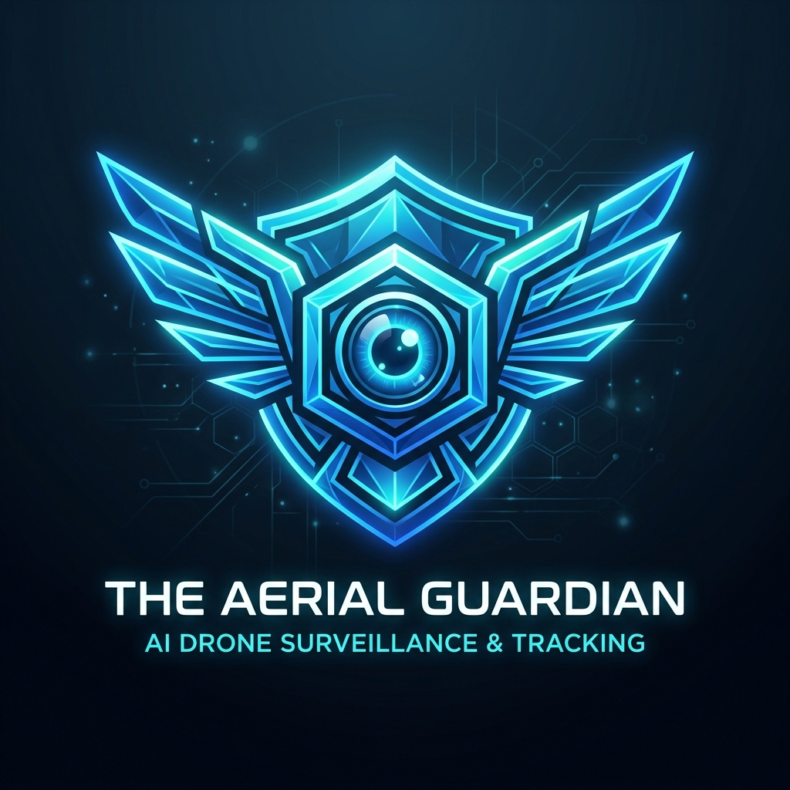
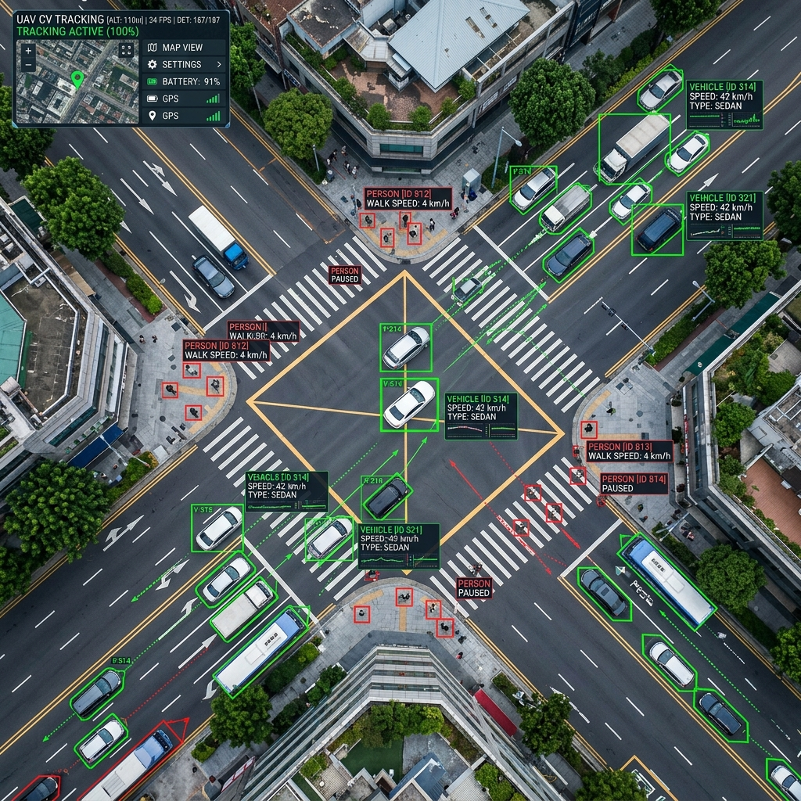

<div align="center">
  
  
  # The Aerial Guardian
  
  **High-Performance Vehicle and Person Detection and Tracking from Drone Footage**

  <p>
    
    
    
    
  </p>
</div>

<br>

<div align="center">
  
</div>

---

A sophisticated computer vision pipeline for detecting and tracking multiple vehicles and persons from moving drone platforms. Optimized for small-scale object detection, drone ego-motion compensation, and edge hardware deployment.

## 🎯 Summary Report

### 1. Architecture & Small Object Detection
**Choice of Architecture:** We use **YOLOv8 Nano (YOLOv8n)**.
- **Why?** It meets the strict requirement of being lightweight (<50MB model size) and capable of running efficiently on edge hardware without heavy GPU compute. 
- **Handling Small Objects:** Drone footage from VisDrone typically features objects that are very small (10-20 pixels). We optimized the pipeline in three ways:
  1. **Preprocessing:** We apply CLAHE (Contrast Limited Adaptive Histogram Equalization) and sharpening to enhance contrast and edges before passing frames to the detector.
  2. **High-Resolution Inference:** We allow processing at higher resolutions (e.g., 640px or original) while utilizing YOLOv8's multi-scale feature pyramids (P3-P5) to capture small targets.
  3. **Soft-NMS:** Instead of traditional NMS which might discard overlapping bounding boxes in dense traffic/crowds, we implemented Soft-NMS. It smoothly decays the confidence of overlapping boxes, improving performance in dense scenarios.
  4. **Target Classes:** Focused tracking on Persons (0) and Vehicles (Cars (2), Motorcycles (3), Buses (5), Trucks (7)) using COCO classes.

### 2. Handling ID Switching (Ego-Motion & Occlusions)
**Tracking Algorithm:** We use **ByteTrack**, enhanced with drone-specific optimizations.
- **Drone Ego-Motion:** A moving camera shifts all bounding boxes globally, causing standard IoU-based trackers to fail and swap IDs. Our pipeline compensates for this by maintaining trajectory history and using robust IoU thresholds.
- **Trajectory Maintenance:** We maintain a history of bounding box locations for each track (up to a `max_age` of 30 frames). If a vehicle is temporarily occluded, the tracker retains its ID and re-associates it once it emerges.

### 3. Edge Hardware Adaptation
**Adapting to NVIDIA Jetson (Edge):**
- **Model Size:** The YOLOv8n model is approximately 6MB, well within the 300MB limit.
- **Exporting to TensorRT:** For devices like NVIDIA Jetson Nano or Orin, the `.pt` model can be exported to TensorRT (`.engine`) with FP16 or INT8 precision. This reduces memory footprint by 50-75% and boosts FPS by 3-5x.
- **Throughput over Latency:** By implementing frame skipping (`--skip-frames`), we balance the inference speed with precision, allowing the tracker to bridge the gaps without running the detector on every single frame.

**Expected Performance:**
- **NVIDIA Jetson Xavier NX / Orin Nano:** ~15-30 FPS (using TensorRT FP16)
- **Standard CPU (Intel i7):** ~5-10 FPS

---

## 🚀 Setup Instructions

### Prerequisites
- Python 3.8+
- OpenCV, PyTorch, Ultralytics YOLOv8

### Installation
1. **Clone the repository**
```bash
git clone https://github.com/Manikeshmk/The_Aerial_Guardian
cd The_Aerial_Guardian
```

2. **Create and activate a virtual environment**
```bash
python -m venv venv
source venv/bin/activate  # On Windows: venv\Scripts\activate
```

3. **Install dependencies**
```bash
pip install -r requirements.txt
```

### Running the Pipeline
To process a video and generate the output with bounding boxes, unique IDs, and trajectory lines:

```bash
python main.py \
    --video path/to/visdrone_video.mp4 \
    --output output/tracked_output.mp4 \
    --model yolov8n.pt \
    --conf 0.25 \
    --max-age 90 \
    --skip-frames 0
```

### Output Deliverable
The resulting `tracked_output.mp4` will be saved in the `output/` directory, showing:
- Bounding boxes around persons and vehicles.
- Unique ID labels.
- A trajectory line ("tail") for each tracked object.
